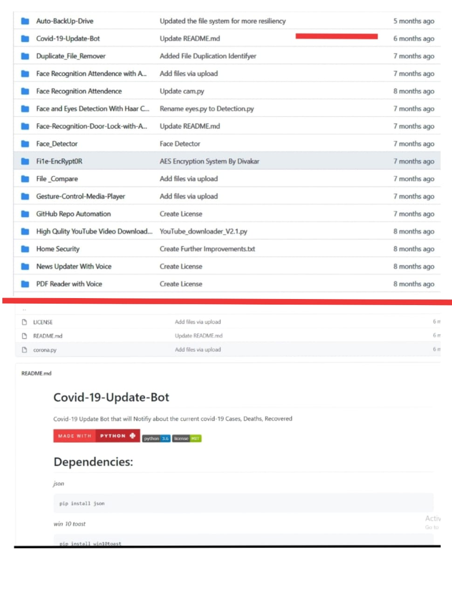

# Java - Open_Source - Projects

 

 

  

        

 

## 🌀 What is this repository for ?

- This repository contains a list of projects bulid using Java . 

- Anyone can contribute their project to this repository .

 

## ☣️ How to contribute for this repo ?

- Fork this repository .

- Create a new project and upload it to this repo .

- Create a pull request ⬆️ .

 

### ⚠️ Use the below link to learn about how to make a pull request  ⏬.

 

### 📌 [Pull request example Video .](https://www.youtube.com/watch?v=_NrSWLQsDL4)

 

## 🌐 Rules

- Do not spam ❎ 

- Every Project must contains separate readme file and that readme will explain the project .

- Create one folder(for one project) and put you project and readme in it.

- push the project like this ⏬

 

**Example :**
 

 

