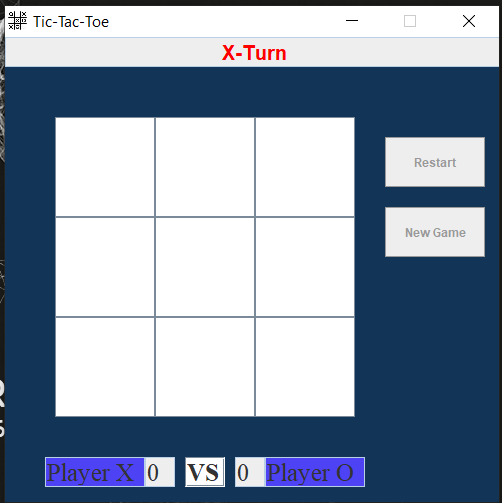

# 🕹 Tic-Tac-Toe

### This Project contains the game Tic-Tac-Toe(XO) . 

- All the rules are same .

- Game Between the two users (Not computer) .

<br />

### 🌉 Use the following to run the code: 

<br />

```
In command prompt :

     For complie : javac Game.java

     For Run     : java Game 
    
```
<br />

<b> Output :</b>

